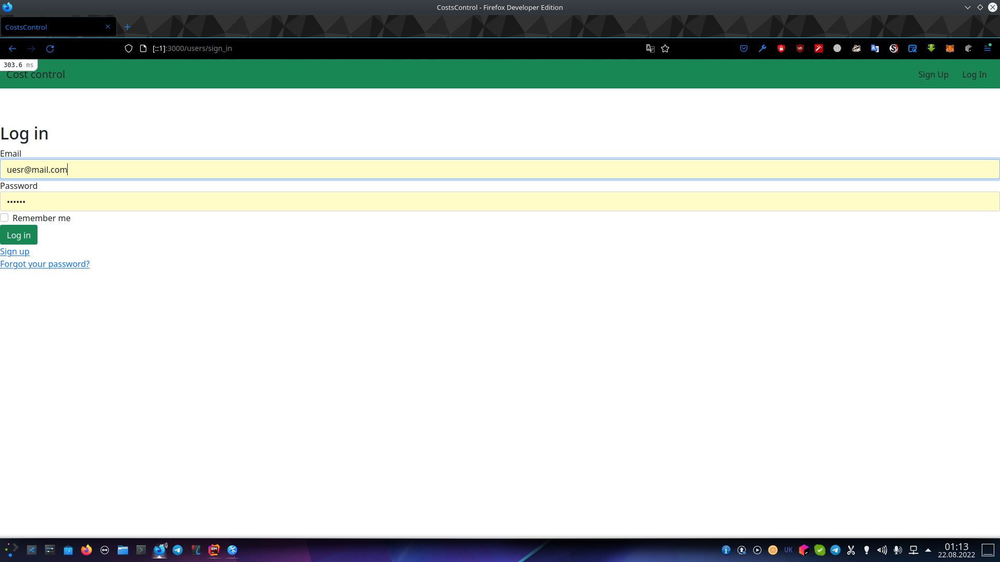
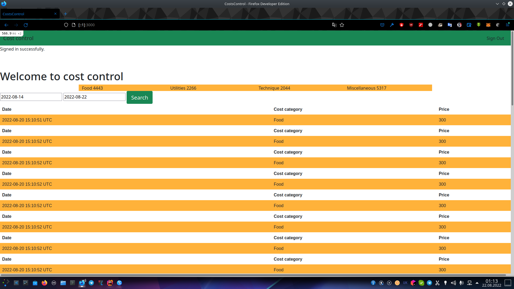
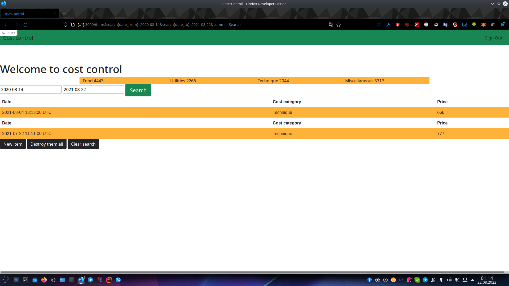
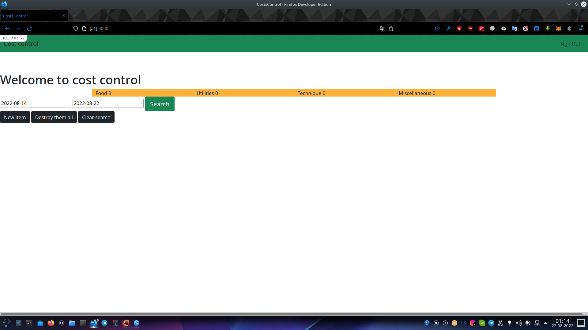

# Costs control

Costs control is a program to control your expenses.

## Installation

* Ruby version
  '2.7.4'
* Rails version
  '6.1.6.1'

After creating the git clone, enter the following commands in the project console:

```
bundle install
rails db:create
rails db:migrate
rails db:seed
rails s 
```
Then open  seeds.rb, copy the user email and user password: `db/seeds.rb`

```ruby
require 'faker'

user = User.create!( 
  email: "uesr@mail.com", #this is the user email.
  password: 123123 #this is the user password.
)
```

register in the same way as in the images

after logging in you should see the following


you can also search for costs by date


also in this image you can see three different buttons


#### 1) New costs :
New costs button lets you create a new costs.
#### 2) Delete them all : 
Delete them all button you to clean up the database costs.
#### 3) Clear search :
Clear search button clears the search costs and lets you see all costs.
